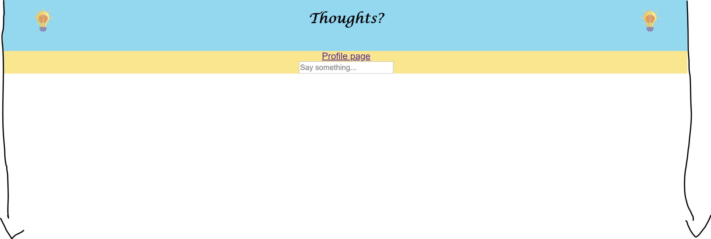

Trying it yourself
==========
git clone (project url)
npm install
npm start

Overview
==========

Thoughts is a web app where a user can log in (using firebase auth), and leave a
message that is added to the firebase realtime database, which the newsfeed
pulls from. This app could be ran on local state by pulling the thoughts feed
from local state, but this would mean that everyone's thoughts would be lost on
refresh. If you click the top right icon, you will be brought to a profile page
where you can update your name and a picture. These will replace your name and
picture on all previous thoughts automatically. Click the top left icon
from the profile page to go back to the thoughts feed. Even though there is a
link on this website, and the profile page is at the "/profile" endpoint, typing
in the url or refreshing will cause you to log out because I did not set up
login persistence.

Challenges
========

## CSS

1. I was unable to center the logos inside of the top border:

Somehow I missed that there was a `float: left` style attribute on the
logo class, so I changed that to `position: relative`. The whole top border is
actually a table, to help with ease in css.

2. I was curious why the background color for the elements would fail to cover
the whole page:

I fixed this by doing `html {background-color: #F8E691}`. I never knew you could
style the entire html document.

3. My icons were squishing when I tried to crop them. I fixed this by making the
img tag a div and changing the `` to
```
<div className = "thumb"
     style = {{backgroundImage: `url(${this.state.propicURL})`}}
     alt = "your propic"/>
```

## React

1. I was having a lot of trouble making the pictures at the top be links using
react-router. I tried nesting the image inside the link like
```
<Link to="/">
  
 </Link>
 ```
and also tried putting a ```background-img``` property on the link. The image
would show up, but the link wouldn't redirect. Eventually, I found
[a component on stackoverflow] that I changed to be
[an image instead of a button].

[a component on stackoverflow]: https://stackoverflow.com/a/49439893/5570385/
[an image instead of a button]: ./src/LinkImage.jsx/

2. I was wondering why the page was refreshing whenever I submitted a form.
Fix: place `e.preventDefault();` in `handleSubmit(e)` handler function.

3. I was having some problems with displaying the name instead of the ID created
for the post by `firebase.database().ref('posts').push();`, javascripts annoying
synchronicity strikes again: the state wasn't updating before I was trying to
use it. I fixed this by making
[a separate component for getting the name] and did
[a similar thing for the picture icons].

[a separate component for getting the name]: ./src/Name.js/
[a similar thing for the picture icons]: ./src/Picture.js/
